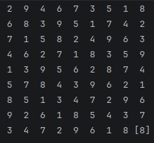

# Sudoku Board Generator
## Purpose
### To learn about git and github:
#### Simple Push to Github
 1. `git add .`
 2. `git commit -m "msg"`
 3. `git push`
### To learn how to make a README.md (Markdown):
#### Typography
 - **bold** text
 - *Italic* text
 - ***Bold and also Italic*** text
 - #### $L^a{_T}^e\mathbb{X}\ E^{q^{u^{a^{t^{i^{o^{n^s}}}}}}}$
 - Keyboard keys: <kbd>Ctrl</kbd> + <kbd>Alt</kbd> + <kbd>F4</kbd>

 #### Structures
 - 1. How to
   2. Make lists
 - `code snippets` and
- ```cpp
   code blocks
  ```
 <!-- hidden comments -->
```diff
+ addition
- subtraction
! modification
```
  <details>
  <summary>Collapsable Blocks</summary>
  Why would you bother clicking here.
  </details>
  
 - [Custom Links](https://22thomas22.github.io/)\
 - Custom Images
 - > quotes
 - Dividers
 ---
 - [x] checked checkboxes
 - [ ] unchecked checkboxes
 - Tables:

| left centered | center centered | right centered |
|:--------------|:---------------:|---------------:|
| one           |       two       |          three |
### And of course, to make a sudoku board quickly.
## Project Outline:

|                                            | main.cpp         | main_bitmask.cpp | main_debug.cpp  | randomGuesser.cpp                          |
|--------------------------------------------|------------------|------------------|-----------------|--------------------------------------------|
| Algorithm                                  | bitmask, tabular | bitmask          | Random Walker   | Random Board Creator                       |
| Runtime<br>(Per Board)                     | 9 microseconds   | 14 microseconds  | 25 microseconds | 10^42 years                                |
| Cycles per Second                          | 100,000          | 70,000           | 40,000          | 40,000,000                                 |
| Customer Satisfaction                      | Great            | Fantastic        | Worthless       | Priceless/Unbeatable (ages like fine wine) |
| How much cleaning gets done while you wait | none             | none             | none            | An entire planet's worth                   |
The clear winner is randomGuesser.cpp.